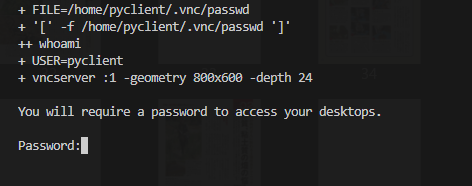

# PDF Page Editor
PDFファイルを編集するデスクトップアプリ


## 現在実装されている機能
- pdfファイルから偶数ページ・奇数ページのみを抽出する

## 概要
1ページおきに空白ページが入ってしまったPDFから必要なページを抽出する


## アプリ使用方法
`pdf_page_editor.exe`をダブルクリックするだけで使えます。

1. 編集したいファイルを選択する<br>


2. 保存先とファイル名を指定したいときはチェックして、ファイル名を指定する<br>
<br>
指定しない場合は`元ファイル名_edited<年月日_時分秒>.pdf`というファイル名で、<br>
元ファイルと同じ場所に保存します。

3. 偶数ページもしくは奇数ページのどちらを抽出するか選択する<br>


4. オプション<br>
<br>
  <br>
  4-1. 開始ページを指定すると、指定ページから抽出する<br>
  <br>
  <br>
  例）偶数ページを抽出する時で、8ページ目から開始を指定すると<br>
  8ページ目以降の偶数ページが新規ファイルとして保存される（図のオレンジ枠部分）<br>
  開始ページより前(図の青枠部分)を残したい場合はチェックを入れる<br>
  <br>
  4-2. 終了ページを指定すると、指定ページより前まで抽出する<br>
  <br>
  <br>
  例）偶数ページを抽出する時で、1ページ前で終了を指定すると<br>
  最後のページから1ページ前の偶数ページが新規ファイルとして保存される（図のオレンジ枠部分）<br>
  終了ページより後(図の青枠部分)を残したい場合はチェックを入れる

5. 作成ボタンをクリックする<br>
  

## 開発
### 概要
- 開発言語
  - python 3.11
- 環境
  - Dockerコンテナ
  - VSCode
- 主要ライブラリ
  - PyMuPDF 1.23
- インタフェース
  - tkinter
- こだわりポイント
  - ドメイン駆動開発とMVCに基づいたプログラミング
  - noVNCを用いてGUIをブラウザから確認できるDockerコンテナ開発環境を構築
  - exe化をDockerコンテナ環境で行い、シェルスクリプトファイルの実行だけで行える環境を構築

### 手順
VSCodeでDockerコンテナにリモート接続し、Dockerコンテナ内で開発を行えます。
1. リモートウィンドウを開く<br>
<br>
1. コンテナ―で再度開くを選択<br>
<br>

> [!NOTE]
> 初回起動時のターミナルにnoVNC用のパスワードを設定するコマンドラインが表示されます。<br>
> 6文字以上のパスワードを設定してください。<br>
> 
>
> もしパスワードを設定するコマンドラインが表示されなかった場合は、Dockerコンテナ内のターミナルで`vnc-setting.sh`を実行してください。<br>
> 

### Dockerコンテナ内でGUIを確認する
`main.py`を実行し、webブラウザから http://127.0.0.1:6080/vnc.html にアクセスすることでtkinterのインタフェースを確認できます。<br>
<br>

### exeファイルの作成
Windowsで実行可能な.exeファイルを作成するために、Dockerコンテナを立ち上げてpyinstallerを使用します。<br>
開発用のDockerコンテナとは別のコンテナを立ち上げます。

> [!IMPORTANT]
> windows環境の方はwslのターミナルで下記のコマンドを実行してください。<br>
> (Linux環境での実行が必要)<br>
> <br>
```
cd <プロジェクトのワーキングディレクトリ>
source build_pyinstaller-windows.sh
```
> [!WARNING]
> このシェルスクリプトは`source`か`.`で実行してください。
> `bash`等ではpermission errorが発生します。
>
> 参考サイト
> [bashシェルスクリプトの実行方法・実行環境](https://www.kenschool.jp/blog/?p=4499)
>
> permission error等で失敗してもリトライすることで上手く行くことが多かったので自動でリトライするようにしていますが、それでも失敗する時は根気よくスクリプトを再実行してください。(未解決)

## 使用されているテクノロジー
- python
- Docker
- tigerVNC
- noVNC

## 将来の機能
[PyMuPDF](https://pymupdf.readthedocs.io/ja/latest/index.html)が実行できる機能は実装可能です。

## License
[MIT](/LICENSE)
